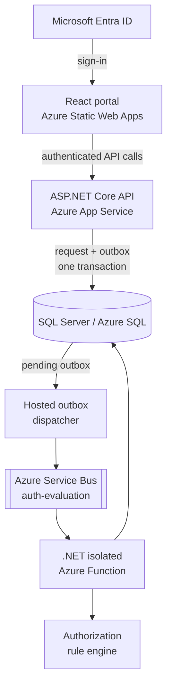

# Prior Authorization Portal

A full-stack prior authorization workflow for prescribers and clinical reviewers. The portal builds request forms from authorization rules, validates the submitted clinical data, evaluates requests asynchronously, and routes selected approvals to a human review queue.

This repository is a demo implementation. It is not a substitute for payer policy, clinical judgment, or a production healthcare compliance review.

## What it does

- Signs users in with Microsoft Entra ID and enforces `Prescriber` and `Reviewer` app roles.
- Resolves the signed-in prescriber to a practitioner record by Entra object ID.
- Generates clinical and medication fields from JSON form definitions stored with each authorization rule.
- Validates requests in both the React client and the API.
- Enforces practitioner specialty requirements before accepting a request.
- Persists each submitted request and its evaluation message atomically through a transactional outbox, then publishes the request ID to Azure Service Bus asynchronously.
- Evaluates boolean, numeric, ordered, required-value, and conditional rules.
- Automatically approves, denies, or requests missing information for eligible requests.
- Routes configured requests that pass automated evaluation to a reviewer.
- Records request creation, messaging, evaluation, status transitions, and reviewer decisions in an audit table.
- Exposes liveness and database health endpoints.

## Request lifecycle

1. A prescriber selects a patient, service or medication, and indication.
2. The API finds the active rule for that code and indication, validates the rule-specific fields, checks the prescriber's specialty, and saves the request as `Submitted`.
3. In one SQL transaction, the API saves the request and an `OutboxMessages` row containing its evaluation message.
4. A hosted outbox dispatcher publishes pending messages to the `auth-evaluation` Service Bus queue and records delivery attempts.
5. An Azure Function loads the request and its rule, runs the authorization engine, and records the result.
6. A passing request is either set to `Approved` or, when the rule requires human review, `UnderReview`. A failing request is set to `Denied`; missing required clinical data produces `NeedsMoreInfo` without a final determination date.
7. A reviewer can approve or deny an `UnderReview` request. The practitioner-scoped prescriber dashboard displays statuses, denial details, and missing-information reasons.

## Architecture



The authorization rule's form definition and evaluation definition live in SQL. The client uses the form definition to render inputs, while the function passes submitted clinical data and the evaluation definition to the rule engine.

## Technology

| Area | Stack |
| --- | --- |
| Web | React 19, TypeScript, Vite 8, Tailwind CSS 4, shadcn/Radix UI, React Hook Form, Zod |
| Identity | Microsoft Entra ID, MSAL, Microsoft.Identity.Web |
| API | ASP.NET Core 9 minimal APIs, FluentValidation |
| Data | Entity Framework Core 9, SQL Server / Azure SQL |
| Messaging | Azure Service Bus |
| Processing | .NET 9 isolated Azure Functions |
| Tests | xUnit, FluentAssertions, Moq, ASP.NET Core integration testing |
| Hosting | Azure Static Web Apps, App Service, Azure Functions |
| Infrastructure | Bicep, GitHub Actions, Azure OIDC |

## Repository layout

| Path | Purpose |
| --- | --- |
| `PriorAuthWeb/` | React portal for prescribers and reviewers |
| `PriorAuthApi/` | Authenticated HTTP API, validation, and request orchestration |
| `PriorAuthFunctions/` | Service Bus evaluation worker and demo-data reset functions |
| `PriorAuth.AuthEngine/` | Database-independent authorization rule evaluator |
| `PriorAuth.Contracts/` | Message contracts shared by the API and function |
| `PriorAuth.Data/` | EF Core entities, migrations, seeders, and audit service |
| `PriorAuthApi.Tests/` | API validator and SQL-backed endpoint tests |
| `PriorAuth.AuthEngine.Tests/` | Unit tests for rule evaluation |
| `infra/` | Modular Bicep templates and deployment guidance for the Azure stack |

## Run locally

### Prerequisites

- [.NET SDK 9.0.315](global.json), or a compatible 9.0 patch SDK
- Node.js `^20.19.0` or `>=22.12.0`
- SQL Server, SQL Server LocalDB, or an accessible Azure SQL database
- An Azure Service Bus namespace with a queue named `auth-evaluation` for end-to-end evaluation
- Azure Functions Core Tools v4
- Azurite or an Azure Storage account for the Functions host
- Microsoft Entra app registrations described under [Identity setup](#identity-setup)

### 1. Restore dependencies

```powershell
dotnet restore PriorAuth.sln
dotnet tool install --global dotnet-ef --version 9.*

cd PriorAuthWeb
npm ci
cd ..
```

If `dotnet-ef` is already installed, update it with:

```powershell
dotnet tool update --global dotnet-ef --version 9.*
```

### 2. Configure the API

Create the ignored file `PriorAuthApi/appsettings.Development.json`:

```json
{
  "ConnectionStrings": {
    "DefaultConnection": "Server=localhost,1433;Database=PriorAuthDb;User Id=sa;Password=YOUR_PASSWORD;TrustServerCertificate=True;",
    "ServiceBus": "Endpoint=sb://YOUR_NAMESPACE.servicebus.windows.net/;SharedAccessKeyName=YOUR_POLICY;SharedAccessKey=YOUR_KEY"
  },
  "AzureAd": {
    "Instance": "https://login.microsoftonline.com/",
    "TenantId": "YOUR_TENANT_ID",
    "ClientId": "YOUR_API_APP_CLIENT_ID",
    "Audience": "api://YOUR_API_APP_CLIENT_ID"
  }
}
```

`DefaultConnection` may use LocalDB or Azure SQL instead. The API can run without `ServiceBus`; in that case submissions remain safely queued in the outbox until a dispatcher is configured. Keep connection strings and credentials out of committed configuration.

### 3. Configure the Functions project

Create the ignored file `PriorAuthFunctions/local.settings.json`:

```json
{
  "IsEncrypted": false,
  "Values": {
    "AzureWebJobsStorage": "UseDevelopmentStorage=true",
    "FUNCTIONS_WORKER_RUNTIME": "dotnet-isolated",
    "SqlConnectionString": "Server=localhost,1433;Database=PriorAuthDb;User Id=sa;Password=YOUR_PASSWORD;TrustServerCertificate=True;",
    "ServiceBusConnection": "Endpoint=sb://YOUR_NAMESPACE.servicebus.windows.net/;SharedAccessKeyName=YOUR_POLICY;SharedAccessKey=YOUR_KEY"
  }
}
```

Start Azurite before the Functions host when using `UseDevelopmentStorage=true`.

### 4. Configure the web app

Create the ignored file `PriorAuthWeb/.env.local`:

```dotenv
VITE_API_URL=http://localhost:5054
VITE_AZURE_CLIENT_ID=YOUR_SPA_APP_CLIENT_ID
VITE_AZURE_TENANT_ID=YOUR_TENANT_ID
VITE_AZURE_API_CLIENT_ID=YOUR_API_APP_CLIENT_ID
```

### 5. Create the database

```powershell
dotnet ef database update `
  --project PriorAuth.Data/PriorAuth.Data.csproj `
  --startup-project PriorAuthApi/PriorAuthApi.csproj
```

### 6. Start the services

Open separate terminals at the repository root.

API:

```powershell
dotnet run --project PriorAuthApi
```

Functions:

```powershell
cd PriorAuthFunctions
func start --port 7028
```

Web:

```powershell
cd PriorAuthWeb
npm run dev
```

Open `http://localhost:5173`. The API listens on `http://localhost:5054` by default.

### 7. Load the demo data

With the Functions host running, call the reset endpoint:

```powershell
Invoke-RestMethod -Method Post -Uri http://localhost:7028/api/DemoResetHttp
```

> **Warning:** this endpoint deletes all medication requests, prior authorization requests, patients, practitioners, organizations, and authorization rules before loading the demo records. The deployed timer function performs the same reset every day at midnight UTC.

The seed data contains procedure and medication scenarios for orthopedics, oncology, rheumatology, endocrinology, and cardiology. To submit a request, the signed-in user's Entra object ID must be assigned to a seeded practitioner whose specialty matches the selected rule.

## Identity setup

The application expects two Entra app registrations:

1. An API registration that:
   - exposes an `access_as_user` delegated scope;
   - uses the application ID URI `api://<API_CLIENT_ID>`;
   - defines `Prescriber` and `Reviewer` app roles;
   - includes the roles in issued access tokens.
2. A single-page application registration that:
   - has `http://localhost:5173` as a redirect URI;
   - has delegated permission to the API's `access_as_user` scope.

Assign each test user one of the API app roles. Prescribers also need a matching `Practitioners.EntraOid` value in the database. The API derives the practitioner from the authenticated token; it does not trust a practitioner ID supplied by the browser.

All domain endpoints require a role. Only `/health`, `/health/db`, and the generated OpenAPI document are anonymous.

## API

The API serves OpenAPI JSON through ASP.NET Core's generated OpenAPI endpoint.

| Method | Route | Role | Purpose |
| --- | --- | --- | --- |
| `GET` | `/health` | Anonymous | Process liveness |
| `GET` | `/health/db` | Anonymous | Database connectivity |
| `GET` | `/authrules/codes` | Prescriber | Active service and medication codes |
| `GET` | `/authrules/{code}/indications` | Prescriber | Active indications for a code |
| `GET` | `/authrules/{code}/{indicationCode}` | Prescriber | Dynamic form and evaluation rule |
| `GET` | `/patients` | Prescriber | Patient choices |
| `GET` | `/practitioners/me` | Prescriber | Practitioner linked to the current identity |
| `GET` | `/priorauth` | Prescriber | Prior authorization dashboard data |
| `POST` | `/priorauth` | Prescriber | Validate, persist, and enqueue a request |
| `GET` | `/priorauth/review-queue` | Reviewer | Requests awaiting manual review |
| `GET` | `/priorauth/{id}` | Reviewer | Request and clinical details |
| `PATCH` | `/priorauth/{id}/decision` | Reviewer | Approve or deny an `UnderReview` request |

## Authorization rules

Each active `AuthRule` matches one service or medication code and one indication. It contains:

- a request type (`Procedure` or `Medication`);
- code, indication, display, specialty, and effective-date metadata;
- a form definition used to render and validate dynamic fields;
- a rule definition used by the evaluation engine;
- a flag indicating whether a passing request still requires manual review.

The engine currently supports:

| Operator | Behavior |
| --- | --- |
| `equals` | Boolean equality |
| `gte` | Numeric minimum |
| `hasValue` | Non-empty value |
| `gte_ordered` | Minimum value in an explicitly ordered string list |
| `conditional` | Selects a `then` or `else` rule branch |

Three clinical scenarios are automatically routed to manual review rather than auto-adjudicated:

1) Genetic testing for Hereditary Breast/Ovarian Cancer (BRCA1/BRCA2)
2) Wegovy
3) Humira for Rheumatoid Arthritis

These scenarios reflect real-world PA workflows where high-cost biologics, weight loss medications, and complex genetic indications typically require clinical reviewer sign-off regardless of structured criteria.

## Testing and quality checks

Run the database-independent rule-engine tests:

```powershell
dotnet test PriorAuth.AuthEngine.Tests
```

Run the complete .NET suite:

```powershell
$env:TEST_CONNECTION_STRING = "Server=localhost,1433;Database=PriorAuthDb_Test;User Id=sa;Password=YOUR_PASSWORD;TrustServerCertificate=True;"
dotnet test PriorAuth.sln
```

When `TEST_CONNECTION_STRING` is absent, the API integration tests fall back to `(localdb)\mssqllocaldb`. The integration fixture creates and deletes its test database.

Build and lint the frontend:

```powershell
cd PriorAuthWeb
npm run build
npm run lint
```

## Deployment

The application deployment workflows run on pushes to `main`:

- `.github/workflows/ci-cd.yml` builds and tests the .NET solution, applies EF migrations, and deploys the API and Functions projects.
- `.github/workflows/deploy-frontend.yml` builds the Vite app and deploys `PriorAuthWeb/dist` to Azure Static Web Apps.

The infrastructure workflow validates and lints `infra/main.bicep` whenever the templates change. Its manual `workflow_dispatch` action can run an Azure what-if preview or deploy the modular stack: Log Analytics, Application Insights, Service Bus, serverless Azure SQL, App Service, Functions, storage, and Static Web Apps. See [`infra/README.md`](infra/README.md) for parameters and post-deployment steps.

Deployment uses GitHub OIDC for Azure login. Runtime app settings are provisioned by Bicep, while SQL database users for the managed identities and frontend identity configuration remain explicit post-deployment steps.

## Current limitations

- The outbox dispatcher does not claim rows, so scaled-out API instances can attempt duplicate delivery. Service Bus duplicate detection and the evaluation worker's status guard make consumers idempotent.
- Requests in `NeedsMoreInfo` display missing fields, but there is not yet an endpoint to amend and resubmit the existing request.
- Rules and forms are JSON stored in SQL and are managed through seed data; there is no rule-authoring UI.
- The demo reset function is intentionally destructive and is not appropriate for a production database.

## License

Licensed under the [MIT License](LICENSE).
